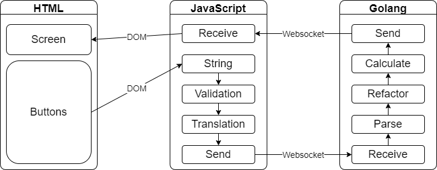
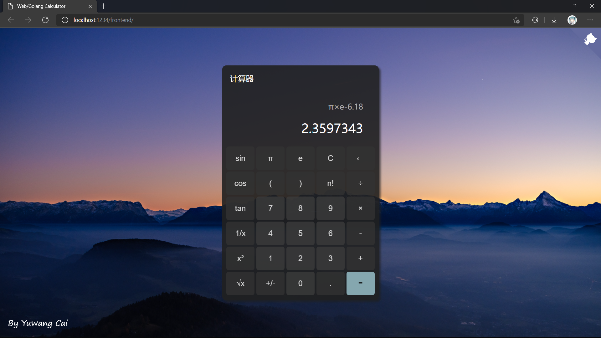
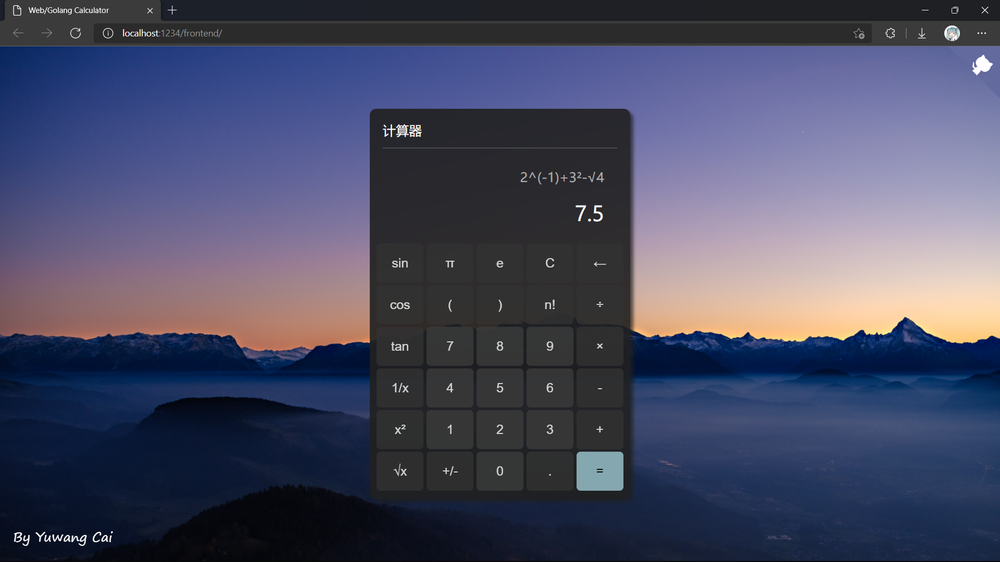

# Web+Golang简易计算器

> 该项目为电子科技大学《Go语言与区块链技术》半期作业。
>
> 姓名：蔡与望
>
> 学号：2020010801024

- [Web+Golang简易计算器](#webgolang简易计算器)
  - [一、项目简介](#一项目简介)
  - [一、源码目录结构](#一源码目录结构)
  - [二、UML图](#二uml图)
  - [三、运行截图](#三运行截图)
    - [3.1 四则运算与括号](#31-四则运算与括号)
    - [3.2 浮点数运算（$\pi$、$e$）](#32-浮点数运算pie)
    - [3.3 三角函数运算](#33-三角函数运算)
    - [3.4 平方、开方、倒数](#34-平方开方倒数)
  - [四、伪代码](#四伪代码)
    - [4.1 后端计算逻辑模块](#41-后端计算逻辑模块)
    - [4.2 后端服务器模块](#42-后端服务器模块)
    - [4.3 前端逻辑](#43-前端逻辑)
  - [五、附录](#五附录)
    - [5.1 编写与运行环境](#51-编写与运行环境)
    - [5.2 项目开源地址](#52-项目开源地址)

## 一、项目简介

本项目实现了一个简易的网页计算器，前端使用`HTML+CSS+Javascript`，后端使用`Golang`，前后端间通过`websocket`进行通信。

目前支持的功能有：

- 整数四则运算
- 多重括号
- 浮点数运算（包括常数$\pi$、$e$）
- 三角函数
- 平方、开方、倒数、阶乘
- 清零、退格


## 一、源码目录结构

```txt
go-calculator
├─ backend                  后端
│    ├─ go.mod              go mod
│    ├─ go.sum              go sum
│    ├─ main.go             主程序入口
│    └─ packages            计算器模块
│           ├─ calc         计算逻辑模块
│           ├─ launch       启动模块
│           └─ stack        栈模块
├─ frontend                 前端
│    ├─ .eslintrc.json      eslint规则
│    ├─ index.html          老三样
│    ├─ script.js           老三样
│    └─ style.css           老三样
└─ run.bat                  批处理文件
```

## 二、UML图



1. 用户：点击HTML页面内按钮；
2. 前端：
   1. 通过`DOM`捕获事件，进行数字与运算符的拼接；
   2. 简单验证输入字符串的合理性，如括号是否配对、小数点不超过一个等；
   3. 将$\pi$、$e$、$\frac{1}{x}$等特殊字符翻译成`3.14`、`2.17`、`^(-1)`等方便计算的字符串；
   4. 通过`Websocket`将字符串传往后端；
3. 后端：
   1. 将字符串解析为数字与运算符的组合；
   2. 调整一些特殊符号的位置，中缀转后缀；
   3. 基于栈结构计算结果；
   4. 通过`websocket`将结果传往前端；
4. 前端：显示计算结果。

## 三、运行截图

### 3.1 四则运算与括号


### 3.2 浮点数运算（$\pi$、$e$）



### 3.3 三角函数运算


### 3.4 平方、开方、倒数



## 四、伪代码

### 4.1 后端计算逻辑模块

```Golang
// 供服务器使用的计算API。
func (calc *Calculator) Calculate(expression string) string {
    // 计算器清零。
    calc.reset()
    // 将前端传来的字符串，解析为数字+运算符的列表。
    calc.parse(expression)
    // 平方、倒数、阶乘等后置运算符，需要调整到被操作数前面。
    calc.adjustOperator()
    // 中缀表达式转后缀表达式，方便计算。
    calc.toPostfix()
    // 基于栈结构计算结果，并返回。
    return calc.getAnswer()
}

// 字符串解析。
func (calc *Calculator) parse(expression string) {
    // 逐个判断字符属于数字还是运算符；
    // 遇到运算符，就说明前面的数字部分结束了。
}

// 将后置运算符前置。
func (calc *Calculator) adjustOperator() {
    // 遍历列表；
    // 如果是后置运算符，就移到被操作数（或者平级括号）的前面。
}

// 中缀转后缀。
func (calc *Calculator) toPostfix() {
    // 遍历列表；
    // 如果是数字，就直接加入表达式；
    // 如果是"("或者运算符栈空，就压栈；
    // 如果是")"，就弹出平级括号间的所有运算符；
    // 如果是别的运算符，就弹出比它优先级高的运算符。
    // 清空栈。
}

// 计算答案。
func (calc *Calculator) getAnswer() string {
    // 遍历列表；
    // 如果是数字，就压栈；
    // 如果是运算符，就弹栈计算这一部分，然后压回去；
    // 最后弹出的就是答案。
}
```

### 4.2 后端服务器模块

```Golang
// 服务器。
func calcHandler(sock *websocket.Conn) {
    // 接收-计算-发送，死循环。
}

// 启动服务器。
func Server() {
    // 添加Handler；
    // ListenAndServe()。
}
```

### 4.3 前端逻辑

```JavaScript
window.onload = () => {
    // 创建套接字，窗口加载完毕后添加事件驱动。
}
// 为同类按钮编写事件响应函数。
// DOM获取对象，为其添加监听事件。
```

## 五、附录

### 5.1 编写与运行环境

- OS: Windows 11
- IDE: Microsoft Visual Studio Code
- Go version: 1.17
- Dependency: `golang.org/x/net v0.0.0-20211112202133-69e39bad7dc2`

### 5.2 项目开源地址

https://github.com/MrCaiDev/go-calculator

> master分支全部为本人所写代码，optimized分支接受过他人的PR。
